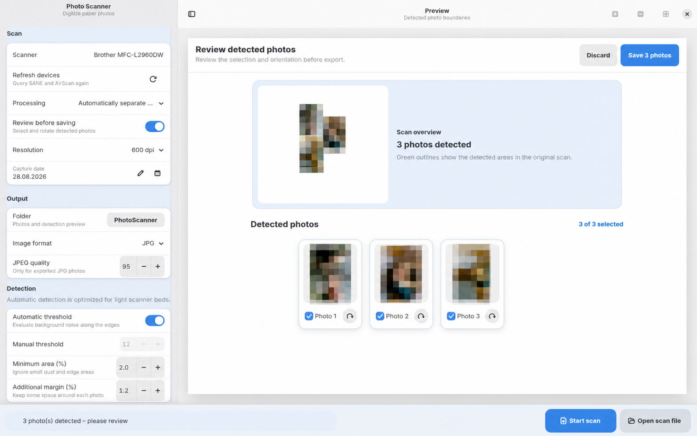

# Photo Scanner

**Deutsch** | [English](README.md)

[](https://github.com/ruhrpotter/photoscanner/actions/workflows/ci.yml)
[](LICENSE)
[](Cargo.toml)

Photo Scanner ist eine native GTK4-Anwendung für Linux, die Stapelscans vom
Flachbettscanner in einzelne, archivfertige Bilder verwandelt. Mehrere
Papierfotos lassen sich in einem Durchgang digitalisieren: Die App scannt über
SANE oder AirScan, erkennt jedes aufgelegte Foto, korrigiert Perspektive und
Ausrichtung und schreibt das Aufnahmedatum in die EXIF-Metadaten. Das Ergebnis
ist direkt für ein Fotoarchiv wie PhotoPrism geeignet.

<picture>
  <source media="(prefers-color-scheme: dark)" srcset="docs/screenshots/review-dark.png">
  
</picture>

## Funktionen

- Mehrere Fotos in einem Durchgang mit 300, 600 oder 1200 dpi scannen.
- Jedes Foto automatisch erkennen, begradigen und perspektivisch korrigieren.
- Ergebnisse vor dem Export prüfen, drehen oder einzeln abwählen.
- Vorhandene PNG-, JPEG- oder TIFF-Scans stapelweise importieren.
- JPG, PNG oder verlustfrei komprimiertes TIFF exportieren, ohne Dateien zu
  überschreiben.
- EXIF-Aufnahmedatum, Zeitzonenoffset, Softwarekennung und DPI schreiben.
- Die Oberfläche reaktionsfähig halten, Fortschritt anzeigen und Scannerarbeit
  abbrechen.
- Bei Bedarf die vollständige Scanfläche statt einzelner Fotos speichern.
- Die native GTK4-Oberfläche unter Wayland oder die CLI zur Automatisierung
  verwenden.
- System-Farbschema und Akzentfarbe übernehmen; eigenes CSS und ein
  Noctalia-v5-Template sind optional.
- Die englische oder deutsche Oberfläche anhand der Prozess-Locale verwenden.

## Kompatibilität und Voraussetzungen

Der aktuelle Quellcode setzt einen neuen Linux-Desktop-Stack voraus:

- Rust 1.92 oder neuer mit Unterstützung für Edition 2024
- GTK 4.22 oder neuer
- Libadwaita 1.9 oder neuer
- OpenCV 5
- SANE sowie `sane-airscan` für eSCL-/AirScan-Netzwerkscanner
- Exiv2 und GNU gettext

Ubuntu LTS und Debian Stable enthalten derzeit nicht alle benötigten Versionen.
Die folgenden Paket- und Build-Anweisungen gelten deshalb für Arch Linux und
CachyOS.

Jeder Flachbettscanner, den `scanimage -L` auflistet, sollte per USB oder
Netzwerk funktionieren. Getestet ist Photo Scanner mit einem Brother
MFC-L2960DW über eSCL/AirScan.

```bash
sudo pacman -S --needed rust clang gtk4 libadwaita opencv sane sane-airscan exiv2 gettext
```

Das Projekt verwendet den CachyOS-/Arch-pkg-config-Namen `opencv5`.

## Starten und installieren

App direkt aus dem Repository bauen und starten:

```bash
make run
```

App einschließlich Launcher, Icon, Metadaten und deutscher Übersetzung für den
aktuellen Benutzer installieren:

```bash
make install-user
```

Die installierte Anwendung startet über den Desktop-Launcher oder mit
`photoscanner gui`.

## Bedienung

1. Scanner auswählen und Fotos mit ungefähr 1 cm Abstand auflegen.
2. Aufnahmedatum, Auflösung, Ausgabeformat und Zielordner festlegen.
3. Automatische Trennung oder die vollständige Scanfläche auswählen.
4. Scannen, erkannte Fotos prüfen, drehen oder abwählen und speichern.

Ein weiterer Scan verwirft eine offene Prüfung. **Vor dem Speichern prüfen**
lässt sich abschalten, wenn Dateien direkt exportiert werden sollen.

### Tastenkürzel

| Aktion | Tastenkürzel |
| --- | --- |
| Scan starten | <kbd>F9</kbd> |
| Aktuellen Vorgang abbrechen | <kbd>Esc</kbd> |
| Eine oder mehrere Scandateien öffnen | <kbd>Strg</kbd> + <kbd>O</kbd> |
| Ausgabeordner auswählen | <kbd>Strg</kbd> + <kbd>L</kbd> |
| Scanner erneut suchen | <kbd>Strg</kbd> + <kbd>R</kbd> |
| Einstellungsleiste ein- oder ausblenden | <kbd>F10</kbd> |
| Vergrößern | <kbd>Strg</kbd> + <kbd>+</kbd> |
| Verkleinern | <kbd>Strg</kbd> + <kbd>-</kbd> |
| Vorschau einpassen | <kbd>Strg</kbd> + <kbd>0</kbd> |
| Beenden | <kbd>Strg</kbd> + <kbd>Q</kbd> |

## Themes und Noctalia

GTK4 und Libadwaita übernehmen Hell-/Dunkelmodus, Kontrastpräferenz und
Akzentfarbe. Zusätzlich lädt und überwacht Photo Scanner:

```text
~/.config/photoscanner/theme.css
```

Ein Beispiel liegt in `docs/theme.css.example`. Für Noctalia v5:

```bash
mkdir -p ~/.config/noctalia/templates
cp docs/noctalia/photoscanner.css ~/.config/noctalia/templates/photoscanner.css
cp docs/noctalia/photoscanner.toml ~/.config/noctalia/photoscanner.toml
noctalia theme --list-templates
```

Anschließend unter **Media & UI → Theme** das Theme erneut anwenden. Bei
Änderungen am erzeugten CSS ist kein Neustart nötig.

## Kommandozeile

```bash
photoscanner devices
photoscanner scan --dpi 600 --date 01.09.1995 --output ~/Bilder/Archiv
photoscanner scan-full --dpi 600 --format tif --output ~/Bilder/Archiv
photoscanner split scan-1.png scan-2.png --output ~/Bilder/Archiv --threshold 10
photoscanner --help
```

Die Stapelverarbeitung läuft nach einem Fehler in einer einzelnen Datei weiter
und endet dann mit einem Fehlerstatus. Ohne `--output` verwenden CLI und GUI
gemeinsam `~/Bilder/PhotoScanner` (oder `output/PhotoScanner`, wenn kein
Bilderordner ermittelt werden kann). Die CLI-Hilfe ist Englisch;
Laufzeitmeldungen folgen der Locale.

## Fehlerbehebung

### Der Scanner wird nicht gefunden

Zuerst `scanimage -L` ausführen. Fehlt der Scanner auch dort, muss zunächst die
SANE-Konfiguration korrigiert werden. Für einen Netzwerkscanner `sane-airscan`
installieren, die Erreichbarkeit im lokalen Netz prüfen und der Erkennung bis zu
30 Sekunden Zeit geben. Mit <kbd>Strg</kbd> + <kbd>R</kbd> lässt sie sich erneut
starten.

### Das Projekt baut unter Ubuntu oder Debian nicht

Die installierten Bibliotheken mit den oben genannten Mindestversionen
vergleichen. Aktuelle Ubuntu-LTS- und Debian-Stable-Versionen sind für diesen
Quellcode zu alt. Bis zum geplanten Flatpak empfiehlt sich eine aktuelle
Arch-/CachyOS-Umgebung.

### Fotos werden nicht korrekt erkannt

Zwischen den Papierfotos ungefähr 1 cm Abstand lassen und eine saubere, helle
Scannerfläche verwenden. Falls nötig, die automatische Schwelle abschalten und
in der Seitenleiste **Manuelle Schwelle**, **Mindestfläche** oder **Zusätzlicher
Rand** anpassen.

## Qualitätssicherung

```bash
sudo pacman -S --needed desktop-file-utils appstream gettext cargo-audit
make check
make audit
```

`make check` prüft Formatierung, Clippy, Tests, CLI-Hilfe, deutschen Katalog,
Desktop- und AppStream-Metadaten. Die Tests decken unter anderem Erkennung,
Begradigung, kollisionsfreie Veröffentlichung und Rollback, Prozessabbruch,
Ressourcenlimits, Prüfexport und Metadaten ab.

## Mitwirken

Fehlerberichte und fokussierte Pull Requests sind willkommen. Vor einem Pull
Request muss `make check` vollständig grün durchlaufen. `make audit` prüft die
Abhängigkeiten.

## Roadmap

- Flatpak-Paket
- AUR-Paket
- breitere Tests mit SANE-kompatiblen Flachbettscannern

## Lizenz

Photo Scanner steht unter der [MIT-Lizenz](LICENSE).
